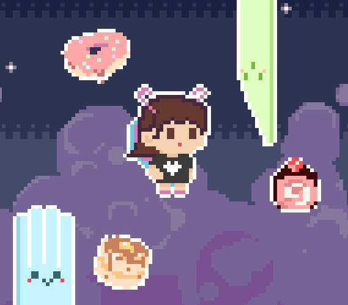

# Flappy Diane
### A flappy-bird-like game
This is a mini game about collecting various dessert to unlock different outfit and levels. Higher score for more rewards.

## Tool used
- **`Aseprite`**: A pixel art image editor.

- **`Fami Studio`**: A Nintendo Entertainment System music editor.

- **`Unity`**: A cross-platform game engine.

## Language
- Written in **`C#`**.

## Develope Status:

⚠️In progress⚠️

## Todos:

### The remaining game mechanisms are still developing:

- An in-game shop(unlock with score and collectibles).
- Switching between different outfit.
- Different levels with higher difficulties.
